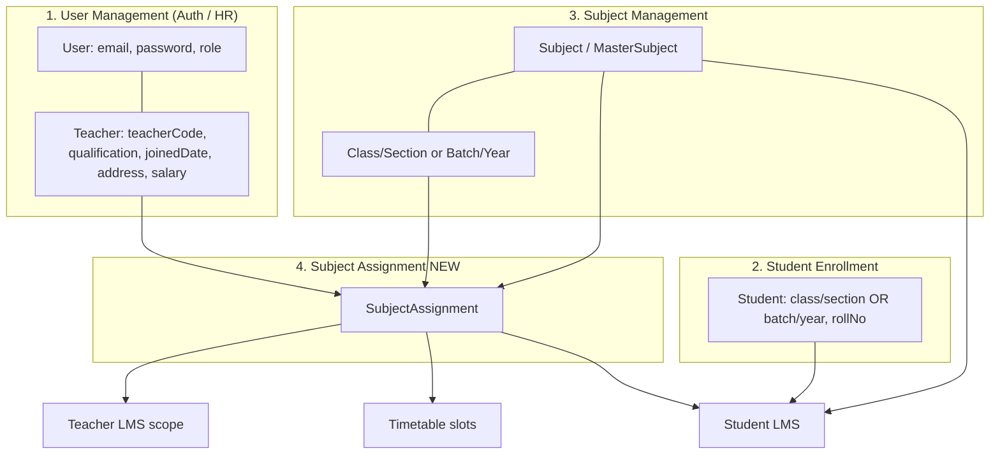
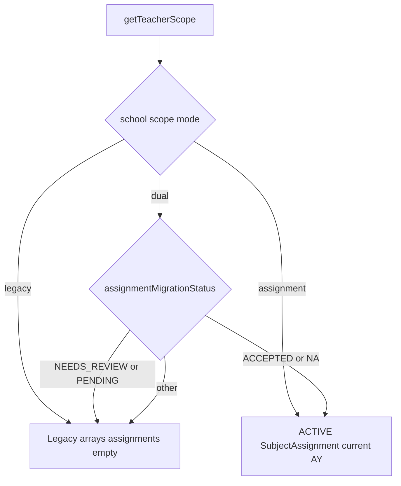
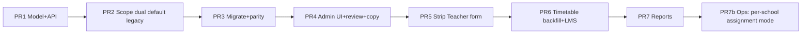
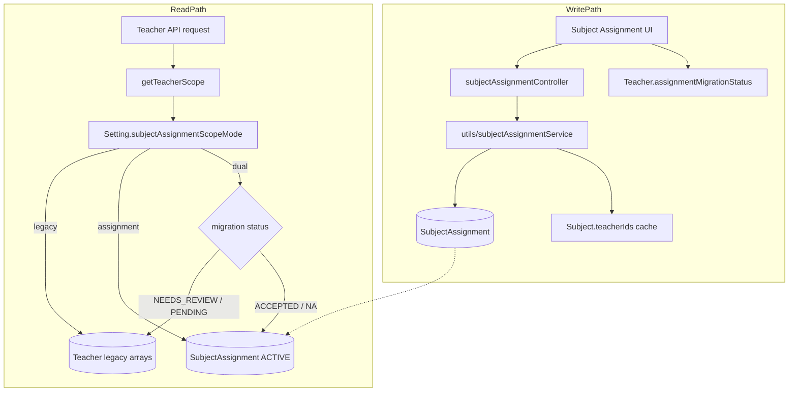

# Subject Assignment Architecture Redesign

| Field | Value |
|-------|-------|
| **Document** | Subject Assignment Architecture Redesign |
| **Project** | New LMS Project (PHIT ERP) |
| **Author** | Engineering (Draft) |
| **Date** | 2026-07-11 |
| **Status** | Draft (Revised after design review) |
| **Institution modes** | `SCHOOL` (class/section) · `COLLEGE` (batch/year) |
| **Related paths** | `backend/src/models/Teacher.ts`, `backend/src/utils/teacherScope.ts`, `backend/src/controllers/teacherController.ts` |
| **Revision** | R2 — addresses re-review issues 27–34 (R1 covered 1–26) |

---

## Overview

Today, creating or editing a **Teacher** also configures academic reach: subjects, classes/sections (school), and batches/years (college) are stored as independent arrays on the `Teacher` document and dual-written to `Subject.teacherIds`. Scope checks (`getTeacherScope` and its assert helpers) treat these arrays as independent sets, so a teacher assigned subjects `{Math, Science}` and classes `{1, 2}` is allowed **any** subject×class combination—not the intended “Math only in Class 1, Science only in Class 2.” There is no first-class model for multi-teacher subjects, unit splits, or percentage workload splits.

This design introduces a **Subject Assignment** module as a fourth independent academic component. Teacher **accounts** remain pure identity/HR records. Academic authorization for Teacher LMS, Student LMS, timetable, attendance, academic management, homework, exams, notices, and result submission is derived from **active Subject Assignment rows** for the current academic year—once a teacher is migration-accepted or created post-cutover. Existing ERP modules keep working via a compatibility layer that preserves a stable `TeacherScopeV2` interface while switching data sources behind a **per-school** scope mode (with process env default).

---

## Background & Motivation

### Current state (problem model)

| Concern | Current implementation |
|---------|------------------------|
| Teacher identity | `Teacher` + `User` (`role: TEACHER`) |
| Teaching assignments | Same form/API as teacher create/update |
| Scope storage | `Teacher.subjects[]`, `assignedClassIds[]`, `assignedSectionIds[]`, `assignedBatchIds[]`, `assignedYearIds[]` |
| Reverse index | `Subject.teacherIds[]` kept in sync in `teacherController.ts` via `syncSubjectTeacherIds` / `removeTeacherFromSubjects` |
| Central resolver | `getTeacherScope()` in `backend/src/utils/teacherScope.ts` |
| Consumers | Full inventory in [References](#references) |

**Cartesian ambiguity (core bug):**  
`assertTeacherSubject` only checks `scope.subjectIds`; `assertTeacherClassSection` only checks class/section. Composition in `assertTeacherSubjectClassSection` does not prove the teacher is assigned that **subject for that class/section**—only that both appear somewhere on the teacher record. For college, the same gap exists for subject×batch×year.

**Missing capabilities:**

- Multiple teachers on one subject for the same class/section (or batch/year) with FULL / UNIT / PERCENTAGE coverage.
- Unit-range and percentage workload validation.
- Effective date ranges and assignment history.
- Timetable binding to an assignment (different teachers for different periods of the same subject).
- Teacher account permanence independent of yearly teaching load.
- Academic-year rollover without re-editing Teacher HR records.

### Pain points

1. Admins re-edit teachers every academic year, conflating HR and academic ops.
2. Teacher LMS shows over-broad students and subjects.
3. No workload reporting by true teaching matrix.
4. Multi-teacher subjects force awkward workarounds (share subject, ignore unit ownership).
5. Seed/demo and forms couple subject multi-select to identity fields (`TeacherForm.tsx`, `TeachersManager.tsx`, `teacherSchema` in shared).

---

## Goals & Non-Goals

### Goals

1. **Decouple** teacher account creation from academic subject assignment.
2. Introduce **`SubjectAssignment`** as the source of truth for “who teaches what to whom, for which academic year, with what coverage.”
3. Support **many-to-many** teacher↔subject↔class-group relationships with FULL / UNIT / PERCENTAGE types.
4. Drive **Teacher LMS** and **Student LMS** visibility from assignments (no manual subject pickers), with **explicit phased matrix correctness** (see [Matrix correctness phases](#matrix-correctness-phases)).
5. Keep **existing ERP features working** during and after migration (attendance FKs, academic plans’ `teacherId`, etc.).
6. Support both **SCHOOL** and **COLLEGE** academic keys with one model.
7. Provide **admin UX** under Academics → Subject Assignment, plus workload/distribution reports and **AY copy/rollover**.
8. **Future-proof**: optional faculty/semester string fields aligned with academic management, without blocking v1.

### Non-Goals

1. Replacing the `Teacher` entity or rewriting attendance/exam documents to drop `teacherId`.
2. Building a full multi-faculty college hierarchy product in v1 (no `Faculty` collection; use string `faculty` like session plans).
3. Changing student enrollment model (students remain linked to class/section or batch/year, **not** to teachers).
4. Redesigning Master Subject curriculum provisioning (college) beyond consuming provisioned `Subject` instances.
5. Multi-tenant RBAC redesign beyond teacher academic scope.
6. Real-time collaboration / conflict resolution UI for concurrent assignment edits (Mongo transactions + set-level revalidation are enough).
7. **Class teacher / coordinator roles:** `Section.classTeacherId` and `SchoolClass.coordinatorId` remain on Class/Section entities. They are **not** modeled as SubjectAssignment and are unrelated to subject teaching rights. Admin UX should not conflate “class teacher” with subject assignment.
8. Period-level subject attendance redesign (keep existing subject+group+date uniqueness).

---

## Proposed Design

### Four independent components



| Component | Responsibility | Key files (today → after) |
|-----------|----------------|---------------------------|
| **1. User Management** | Person + login only | `Teacher.ts`, `teacherController.ts`, `TeacherForm.tsx` — **strip** subjects/assigned* from create/update |
| **2. Student Enrollment** | Academic placement | `Student.ts`, student controllers — **unchanged** |
| **3. Subject Management** | Catalog by class/year | `Subject.ts`, `MasterSubject.ts` — catalog authority; `teacherIds` is **non-authoritative cache** |
| **4. Subject Assignment** | Teaching matrix | **New** model, controller, utils, routes, UI, reports |

### Domain model: `SubjectAssignment`

```typescript
// Conceptual schema — backend/src/models/SubjectAssignment.ts

type AssignmentType = "FULL" | "UNIT" | "PERCENTAGE";
/** Lifecycle of a row. Status is authoritative for scope (see Effective dates). */
type AssignmentStatus = "ACTIVE" | "ENDED" | "SUPERSEDED";

interface SubjectAssignment {
  _id: ObjectId;
  schoolId: ObjectId;                 // tenant
  academicYearBs: string;             // e.g. "2083/2084" — aligns with Setting / Class / Batch / Timetable

  // Optional metadata — align naming with AcademicSessionPlan (faculty?: string, semesterBs?: string)
  faculty?: string | null;            // free-text program/faculty label (not ObjectId in v1)
  semesterBs?: string | null;         // BS semester label when used; null for year-only colleges

  // SCHOOL keys (required together when institution is SCHOOL)
  classId?: ObjectId | null;
  sectionId?: ObjectId | null;

  // COLLEGE keys (required together when institution is COLLEGE)
  batchId?: ObjectId | null;
  yearId?: ObjectId | null;

  subjectId: ObjectId;                // ref Subject
  teacherId: ObjectId;                // ref Teacher (person), NOT User

  assignmentType: AssignmentType;

  // UNIT only — inclusive unit numbers; null otherwise
  unitFrom?: number | null;
  unitTo?: number | null;

  // PERCENTAGE only — integer 1..99 in v1 (100 must use FULL); null otherwise
  assignedPercentage?: number | null;

  effectiveFromBs: string;            // BS date — audit / reporting window
  effectiveToBs?: string | null;      // set when ended/reassigned; required when status ≠ ACTIVE

  status: AssignmentStatus;           // ACTIVE | ENDED | SUPERSEDED — authoritative for scope
  remarks?: string;

  // Optional link when this row superseded another
  supersedesAssignmentId?: ObjectId | null;
  supersededByAssignmentId?: ObjectId | null;

  // Audit
  createdBy: ObjectId;                // User
  updatedBy?: ObjectId;
  endedBy?: ObjectId;
  endReason?: string;

  createdAt: Date;
  updatedAt: Date;
}
```

#### Status semantics: ENDED vs SUPERSEDED

| Status | When set | Meaning for reports/history |
|--------|----------|----------------------------|
| **ACTIVE** | Create / accept | Authoritative for scope and validation sets |
| **ENDED** | Admin “End assignment” without creating a replacement in the same flow | Natural or administrative end; no successor |
| **SUPERSEDED** | **Reassign** transaction: old row closed because a new ACTIVE row replaced the teacher (or coverage) | Ended because of replacement; link via `supersedesAssignmentId` / `supersededByAssignmentId` |

Never leave `status: ACTIVE` with `effectiveToBs` in the past as the scope mechanism—**end/reassign APIs must flip status**.

#### Effective dates vs status (single source of truth)

| Rule | Decision |
|------|----------|
| **Scope queries** | Filter `status: "ACTIVE"` **only** (+ current `academicYearBs` + tenant). Do **not** also require date-window math in hot path. |
| **End / reassign** | Must set `status` to `ENDED` or `SUPERSEDED`, set `effectiveToBs`, `endedBy`, `endReason`. |
| **Optional job** | Nightly job may end rows where `effectiveToBs < todayBs` and status still ACTIVE (safety net if clients set end date without calling end API). Uses existing BS date utils (`nepaliDate` / `ensureValidBsDate`). |
| **Reporting** | History/list may filter by `effectiveFromBs`/`effectiveToBs` for “who taught when”; scope does not. |

#### Teacher migration marker (not AssignmentStatus)

Hybrid migration and dual-read require a **per-teacher** marker separate from assignment row status:

```typescript
// On Teacher document (new field)
assignmentMigrationStatus: "NA" | "PENDING" | "NEEDS_REVIEW" | "ACCEPTED";
// Schema default MUST be "PENDING" (never "NA") when the field is introduced.
// Missing / undefined on pre-existing docs: treat as PENDING in dual resolver (legacy path).
//
// NA          — new teachers AFTER PR 5 (HR-only create; no legacy array writes); assignment mode uses rows only
// PENDING     — not yet migrated / not yet accepted; dual MUST use legacy arrays
// NEEDS_REVIEW— complex multi-group multi-subject teacher; dual-read MUST use legacy only
// ACCEPTED    — admin accepted migrated/edited matrix; dual/assignment modes use SubjectAssignment rows
```

**Mongoose schema default (PR 1):**

```typescript
assignmentMigrationStatus: {
  type: String,
  enum: ["NA", "PENDING", "NEEDS_REVIEW", "ACCEPTED"],
  default: "PENDING", // critical: do NOT default to NA
  index: true
}
```

Existing teachers without the field: dual resolver treats missing as `PENDING` (legacy). One-time migration in PR 1 may `$set: { assignmentMigrationStatus: "PENDING" }` where unset.

| API | Purpose |
|-----|---------|
| `GET /academics/subject-assignments/migration-review` | List teachers with `NEEDS_REVIEW` / `PENDING` + suggested CSV fields |
| `POST /academics/subject-assignments/migration-review/:teacherId/accept` | Requires ≥1 ACTIVE assignment for current AY (or explicit empty-accept with confirm for non-teaching staff); sets `ACCEPTED` |
| `POST /academics/subject-assignments/migration-review/:teacherId/reject-to-legacy` | Keeps/sets `NEEDS_REVIEW`; ensures no ACTIVE rows (or ends them) so dual stays on legacy |

#### `assignmentMigrationStatus` lifecycle (create/update during dual)

Prevents dual under-grant when the Teacher form still writes legacy arrays (PR 1–4) and silent desync for `ACCEPTED` teachers.

| Phase | School scope mode | `createTeacher` status | `updateTeacher` assignment fields (`subjects` / assigned*) | Notes |
|-------|-------------------|------------------------|------------------------------------------------------------|-------|
| **PR 1–2** | `legacy` (default) | Set/default **`PENDING`** | Write arrays as today | Field present; unused for scope |
| **After PR 3 dual-on**, form still present | `dual` | Always **`PENDING`** — do **not** set `NA` and do **not** auto-accept. Optionally run hybrid classifier offline only via migration script, not on every create. | If status **`ACCEPTED` or `NA`**: **reject** non-empty assignment field changes with **400** (`"Teaching load is managed in Subject Assignment"`). Empty/omitted assignment fields: leave existing arrays untouched (or no-op). If **`PENDING` or `NEEDS_REVIEW`**: allow legacy array writes as today. | Prevents empty-assignment under-grant and silent Teacher-form desync |
| **PR 5+** | any | **`NA`**; no array writes | HR only; ignore/reject assignment keys | As designed |

**Dual resolver missing-value rule:**

```text
status = teacher.assignmentMigrationStatus ?? "PENDING"
// never coerce missing → NA
```

**Do not** copy PR 5 “create → NA” into earlier PRs while the form still persists legacy arrays.

#### Indexes (MongoDB)

```javascript
// Prevents same teacher from two ACTIVE rows for same subject+group+AY
// Does NOT enforce FULL exclusivity across different teachers — application validates that
{
  key: {
    schoolId: 1,
    academicYearBs: 1,
    subjectId: 1,
    teacherId: 1,
    classId: 1,
    sectionId: 1,
    batchId: 1,
    yearId: 1,
    status: 1
  },
  unique: true,
  partialFilterExpression: { status: "ACTIVE" },
  name: "uniq_active_teacher_subject_group_year"
}

// Validation / set load path (non-unique)
{ schoolId: 1, academicYearBs: 1, subjectId: 1, classId: 1, sectionId: 1, status: 1 }
{ schoolId: 1, academicYearBs: 1, subjectId: 1, batchId: 1, yearId: 1, status: 1 }

// Teacher LMS / getTeacherScope
{ schoolId: 1, teacherId: 1, status: 1, academicYearBs: 1 }

// Reports
{ schoolId: 1, academicYearBs: 1, status: 1 }
```

**Null handling + pre-save normalize:**

```typescript
// subjectAssignmentSchema.pre("validate")
function normalizeGroupKeys() {
  if (schoolMode) {
    this.batchId = null;
    this.yearId = null;
    // classId + sectionId required
  } else {
    this.classId = null;
    this.sectionId = null;
    // batchId + yearId required
  }
  if (this.assignmentType !== "UNIT") {
    this.unitFrom = null;
    this.unitTo = null;
  }
  if (this.assignmentType !== "PERCENTAGE") {
    this.assignedPercentage = null;
  }
}
```

**Always write explicit `null`** for unused mode fields so compound unique indexes treat school rows consistently. PR 1 acceptance tests must cover school and college unique-violation cases (two ACTIVE same natural key → 11000).

### Institution mode validation matrix

| Institution | Required keys | Forbidden keys | Subject membership check |
|-------------|---------------|----------------|---------------------------|
| **SCHOOL** | `classId`, `sectionId` | `batchId`, `yearId` non-null | `Subject.classIds` contains `classId`. **Section is organizational only**—subjects are not section-scoped; do **not** require a fictional `subject.sectionIds`. Validate `Section.classId === classId`. |
| **COLLEGE** | `batchId`, `yearId` | `classId`, `sectionId` non-null | `Subject.yearIds` contains `yearId` and `Year.batchId === batchId` (same spirit as `validateCollegeTeacherSubjects`). **College section is out of scope** until a college section model exists. |

Reject cross-mode fields with 400 (mirror `validateTeacherScope` in `teacherController.ts`).

### Assignment types & validation

| Type | Meaning | Row rules | Cross-row rules (same subject + group + academicYearBs, **ACTIVE only**) |
|------|---------|-----------|------------------------------------------------------------------|
| **FULL** | One teacher owns 100% of the subject for that group | units null; % null | At most **one** ACTIVE FULL row total (any teacher). No concurrent UNIT/PERCENTAGE rows. |
| **UNIT** | Teacher owns inclusive unit range | `unitFrom` ≤ `unitTo`, both ≥ 1 | No overlapping unit intervals. No FULL. No mix with PERCENTAGE. |
| **PERCENTAGE** | Workload split | `assignedPercentage` ∈ 1..99 | Sum of ACTIVE % ≤ 100; soft-allow sum &lt; 100 with `warnings[]`; hard-block timetable create when any % rows exist and sum ≠ 100. No FULL. No mix with UNIT. |

#### Validation edge-case decisions

| Edge | Decision |
|------|----------|
| FULL vs single PERCENTAGE 100 | **Reject** `assignedPercentage: 100`. Client must use `assignmentType: FULL`. |
| UNIT without session plan | Cap `unitTo` at **50** unless an `AcademicSessionPlan` exists for subject+group+teacher/AY—then max = max `unitNo` on that plan (or plan units union if multi-teacher). Admin override: remarks required if exceeding plan max. |
| Same teacher two non-contiguous unit ranges | v1 unique index blocks two ACTIVE rows. **UX:** create one wide range covering both, or wait for v1.1 multi-range array. Document in admin help. |
| PATCH one percentage row | **Set-level revalidation** against DB siblings after merge (same as bulk). |
| Soft-allow sum &lt; 100 | Nest warnings in **`data`** (no `sendSuccess` shape change): `sendSuccess(res, msg, { rows, warnings }, 201)`. UI banner from `data.warnings`. Do **not** add top-level `meta` unless a separate response-envelope RFC lands. |
| “Publish timetable” gate | **No publish endpoint exists.** Gate on `createTimetableSlot` / `updateTimetableSlot`: if subject+group+AY has any ACTIVE PERCENTAGE rows and sum ≠ 100 → **400**. FULL/UNIT unaffected. |
| Reassign mid-year with attendance/plans | Keep historical `teacherId` on past attendance/plans. New teacher creates new plans as needed. Existing open DRAFT plans of old teacher: leave owned by old teacher (read-only if no longer ACTIVE assignment); admin may reassign plan `teacherId` manually. No automatic plan transfer in v1. |

#### Set-level validation against DB (required on every write)

Unique index only prevents **same teacher** duplicate natural key—not multi-teacher FULL conflicts or unit overlap.

On **every** `POST`, `POST /bulk`, `PATCH`, `end`, `reassign`:

1. Run inside **`withTransaction` from `backend/src/utils/transaction.ts`** (preferred; retries transient errors; `session` may be `null` on standalone Mongo).
2. Load all **ACTIVE** rows for `(schoolId, academicYearBs, subjectId, group keys)` with `getSessionOption(session)`.
3. Merge proposed state (insert/update/delete-from-set for end).
4. Validate: FULL count ≤ 1; no type mix; no unit overlap; % sum ≤ 100; no duplicate teacher; subject membership; mode keys.
5. Commit (handled by `withTransaction` on success).

**Standalone Mongo:** `withTransaction` invokes the callback with `session === null` (no multi-doc atomicity)—same residual race as the rest of the ERP in non-replica-set dev; production uses replica set.

```typescript
// utils/subjectAssignmentService.ts — conceptual (see Appendix A for full write helper)
import { withTransaction, getSessionOption } from "./transaction.js";

async function validateMergedActiveSet(
  merged: DraftRow[],
  opts: { maxUnit: number; allowExceedMaxUnit: boolean }
): Promise<string[] /* warnings */> {
  const types = new Set(merged.map((r) => r.assignmentType));
  if (types.has("FULL") && merged.length !== 1) {
    throw new ApiError(400, "FULL assignment must be the only active teacher for this subject and group");
  }
  if (types.has("UNIT") && types.has("PERCENTAGE")) {
    throw new ApiError(400, "Cannot mix UNIT and PERCENTAGE assignments");
  }
  if (types.has("FULL") && (types.has("UNIT") || types.has("PERCENTAGE"))) {
    throw new ApiError(400, "Cannot combine FULL with UNIT or PERCENTAGE");
  }
  // unit overlap (respect opts.maxUnit), percentage sum, duplicate teachers...
  const warnings: string[] = [];
  if (types.has("PERCENTAGE")) {
    const sum = merged.reduce((s, r) => s + (r.assignedPercentage ?? 0), 0);
    if (sum > 100) throw new ApiError(400, "Assigned percentage exceeds 100%");
    if (sum < 100) warnings.push(`Percentage coverage is ${sum}% (must total 100% before timetable slots can be created)`);
  }
  return warnings;
}
```

### “Add Another Teacher” UX semantics

Admin fills shared academic context (year, group, subject), then adds one or more **teacher rows**. Single `POST .../bulk` creates the set transactionally.

```mermaid
sequenceDiagram
  participant Admin
  participant UI as SubjectAssignmentManager
  participant API as subjectAssignmentController
  participant Svc as subjectAssignmentService
  participant DB as MongoDB

  Admin->>UI: Select AY, group, subject; teachers + types
  UI->>API: POST /academics/subject-assignments/bulk
  API->>Svc: validateMergedActiveSet in transaction
  Svc->>DB: load ACTIVE + insert/update
  API-->>UI: 201 + rows + warnings[]
```

### Scope resolution redesign

#### Stable shape: always `TeacherScopeV2`

```typescript
export interface TeacherAssignmentPair {
  subjectId: string;
  classId?: string;
  sectionId?: string;
  batchId?: string;
  yearId?: string;
  assignmentId: string;
  assignmentType: "FULL" | "UNIT" | "PERCENTAGE";
  unitFrom?: number | null;
  unitTo?: number | null;
  assignedPercentage?: number | null;
}

/** Stable in all scope modes — never omit fields */
export interface TeacherScopeV2 {
  teacherId: string;
  subjectIds: string[];
  classIds: string[];
  sectionIds: string[];
  batchIds: string[];
  yearIds: string[];
  assignments: TeacherAssignmentPair[]; // [] in pure legacy mode
  academicYearBs: string;
  scopeSource: "legacy" | "assignment";
}
```

`getTeacherScope` return type is always `TeacherScopeV2 | null`. Legacy mode fills aggregate arrays from Teacher fields and sets `assignments: []`, `scopeSource: "legacy"`.

#### Scope mode resolution (per school, not process-only)

`backend/src/config/env.ts` remains process-wide defaults. **Authoritative mode is per school** on `Setting` (same document as `academicYearBs`):

```typescript
// Setting (additive)
subjectAssignmentScopeMode?: "legacy" | "dual" | "assignment"; // default from env
```

```typescript
function resolveScopeMode(schoolSetting, env): "legacy" | "dual" | "assignment" {
  return schoolSetting.subjectAssignmentScopeMode
    ?? env.SUBJECT_ASSIGNMENT_SCOPE_DEFAULT
    ?? "legacy";
}
```

| Env / Setting value | Meaning |
|---------------------|---------|
| `legacy` | Always Teacher arrays; `assignments: []` |
| `dual` | Use dual precedence table below |
| `assignment` | Always SubjectAssignment ACTIVE rows for current AY; ignore legacy arrays |

**Do not** claim “flip tenants via env alone.” Ops flip **per school** via Setting (Super Admin multi-school). Env sets the default for schools without an override.

#### Dual-mode precedence (critical — replaces “any ACTIVE row”)

```text
resolveTeacherScopeSource(teacher, mode, currentAy):
  // Missing field on old docs MUST NOT become NA
  status = teacher.assignmentMigrationStatus ?? "PENDING"

  if mode == legacy:
    return LEGACY

  if mode == assignment:
    return ASSIGNMENT   // even if empty → empty scope (strict)

  // mode == dual
  if status == "NEEDS_REVIEW" or status == "PENDING":
    return LEGACY       // never prefer partial assignment backfill

  if status == "ACCEPTED" or status == "NA":
    return ASSIGNMENT   // NA only after PR 5 HR-only create; empty means no teaching load

  // fallback
  return LEGACY
```

| Step | Condition | Source |
|------|-----------|--------|
| 1 | Mode `legacy` | Legacy arrays |
| 2 | Mode `assignment` | ACTIVE SubjectAssignments for current AY only |
| 3 | Dual + `NEEDS_REVIEW` or `PENDING` | **Legacy only** (even if some ACTIVE rows exist from mistaken partial migrate) |
| 4 | Dual + `ACCEPTED` or `NA` | **Assignments only** |
| 5 | Else | Legacy |

**Admin “Accept review”:** validates matrix (or confirms non-teaching), sets `assignmentMigrationStatus: ACCEPTED`. From then on dual uses assignments only.

**Appendix B dual path must follow this table**—not “any ACTIVE row.”



#### Matrix correctness phases

| Phase | When | Behavior |
|-------|------|----------|
| **v1 (PR 2)** | After dual/assignment for ACCEPTED teachers | **Matrix asserts when `subjectId` + group keys are both present** (`assertTeacherSubjectAcademicScope` matches a pair). Independent `assertTeacherSubject` / class-only checks use aggregate sets **only when the other key is absent**. |
| **Student lists v1** | Same | `getTeacherStudentFilter` = students in **union of groups appearing in pairs** (or legacy group arrays). A teacher who teaches only Math in 1-A still sees **all students in 1-A** as “My Students”—**known limitation**, not full subject-level student ACL. |
| **Query without subject** | v1 | `assertTeacherQueryScope` with only classId/sectionId still set-based. |
| **Tightening vs legacy** | Migration | Pair-derived section lists require section∈class membership—**intentional tightening** vs legacy independent `assignedSectionIds` for ACCEPTED teachers. |

Goal 4 is met for **subject-scoped actions** (attendance, homework, timetable create, marks, **notices when both subject and group are set**) in v1; dashboard “My Students” remains group-union until a future product asks for subject-filtered rosters.

#### Call sites that compose independent asserts (cartesian residual)

Central helpers alone are not enough if a controller still does:

```typescript
if (payload.subjectId) await assertTeacherSubject(req, payload.subjectId);
if (payload.classId && payload.sectionId) await assertTeacherClassSection(req, payload.classId, payload.sectionId);
```

Under `scopeSource === "assignment"`, aggregate sets still allow Math (from 1-A) + class 2-A (from Science) unless the **combined** matrix helper is used.

**PR 2 rule:** when the request payload has `subjectId` **and** a full group (`classId+sectionId` or `batchId+yearId`), call **`assertTeacherSubjectAcademicScope`** (or a thin wrapper `assertTeacherSubjectAndGroupIfPresent`). Do **not** compose independent subject + group asserts.

| File / path | Required change in PR 2 |
|-------------|-------------------------|
| `noticeController.ts` create/update | Replace separate `assertTeacherSubject` + `assertTeacherClassSection` with matrix helper when both subject and group present; keep subject-only or group-only paths on independent helpers |
| Any other write path that today composes both independently | Same rule — audit during PR 2 (homework/timetable/attendance already use matrix helper for writes) |

#### Assert helpers and `Subject.teacherIds`

| Helper | New behavior |
|--------|----------------|
| `getTeacherScope` | Dual precedence + stable V2 shape |
| `assertTeacherSubjectAcademicScope` | Require matching pair when `scopeSource === "assignment"`; legacy path keeps old checks |
| `assertTeacherSubject` | Subject in scope sets/pairs; **do not** require `Subject.teacherIds` contains teacher (cache is non-authoritative) |
| `getTeacherStudentFilter` | Group union as above |
| `assertTeacherQueryScope` | Prefer pair when subject+group provided |

**All assert logic changes live in `teacherScope.ts`** so every controller inherits behavior without per-file drift. Controllers that **compose** independent asserts or **build filters** using `teacherIds` still need explicit call-site updates (see inventory + notice table above).

### Teacher account vs assignment

**Create/update teacher API** becomes HR-only:

```typescript
// teacherSchema (shared) — target shape
z.object({
  fullName: z.string().min(2),
  email: portalLoginIdSchema,
  phone: z.string().optional().or(z.literal("")),
  password: optionalPortalPasswordSchema,
  teacherCode: z.string().min(1),           // Employee ID
  qualification: z.string().min(2),
  joinedDateBs: bsDateSchema,
  address: addressSchema,
  basicSalaryNpr: moneySchema
  // Optional NEW wiring (not currently on teacherSchema): map to User.designation / User.department
  // only if product wants them on the teacher form—not required for this redesign.
  // designation?: string; department?: string;
});
```

**Note:** `User` already has optional `designation`, `department`, `employeeId`. Current `createTeacher` does **not** set them. Adding them is optional product expansion, not part of the assignment redesign.

**New teachers after PR 5 only:** `assignmentMigrationStatus: "NA"`. Teaching load configured only via Subject Assignment UI. **Before PR 5, create always sets `PENDING`** (see lifecycle table)—never `NA` while the form still writes legacy arrays.

**Deprecation of legacy arrays on `Teacher`:**

1. Keep fields for `legacy`/`dual` PENDING/NEEDS_REVIEW.
2. **Interim (PR 4, dual-on):** freeze Teacher form assignment multi-selects when `assignmentMigrationStatus ∈ {ACCEPTED, NA}` — read-only summary + link “Manage in Subject Assignment.” Backend rejects assignment-field updates for those statuses (see lifecycle table).
3. Stop writing from create/update once UI ships (PR 5); strip multi-selects entirely.
4. Named script `scripts/mirrorAssignmentsToTeacherArrays.ts` if rollback after strip needs dual mirror—not optional prose; deliver with PR 5 if assignment-only not yet default.
5. Remove fields after soak (PR 8).

### Teacher LMS

**Endpoint:** `GET /teacher/scope` (`teacherPortalController.getTeacherAssignments`).

**Target:**

1. Resolve scope via dual precedence / V2.
2. **Subject loading trusts scope**, not `Subject.teacherIds`:
   - `Subject.find({ _id: { $in: scope.subjectIds }, schoolId, ...group membership })`
   - Remove dependency on `teacherIds: scope.teacherId` filter for portal correctness.
3. **Opportunistic `$addToSet` teacherIds:** keep as **repair** while any school is in `legacy` or `dual` OR until `SUBJECT_ASSIGNMENT_TEACHERIDS_REPAIR=false`. Stop only when all schools are `assignment` and recompute has run. Prefer assignment service as primary writer; portal repair is belt-and-suspenders.
4. Return `assignmentDetails` for UI cards when `scopeSource === "assignment"`.

Frontend `useTeacherScope` types use `TeacherScopeV2`; extra fields ignored until PR 6 UI polish.

### Student LMS

Enrollment unchanged. Assigned teachers:

```typescript
SubjectAssignment.find({
  schoolId,
  academicYearBs,
  status: "ACTIVE",
  subjectId: { $in: enrolledSubjectIds },
  ...(college
    ? { batchId: student.batchId, yearId: student.yearId }
    : { classId: student.classId, sectionId: student.sectionId })
}).populate("teacherId");
```

### Timetable

**Today:** `TimetableSlot` has `subjectId` + `teacherId` (+ group + `academicYearBs`).

**Target:**

1. Add optional `subjectAssignmentId`.
2. When school Setting `subjectAssignmentTimetableRequired === true` (or env default): require non-null `subjectAssignmentId` on **new** writes; validate assignment matches teacher/subject/group/AY/ACTIVE.
3. Keep denormalized `teacherId` / `subjectId` for queries and daily attendance first-period logic.

#### Timetable backfill (required before require-flag)

**Script:** `backend/src/scripts/backfillTimetableSubjectAssignmentIds.ts` (PR 6 or PR 3 companion).

```text
For each TimetableSlot missing subjectAssignmentId:
  Find ACTIVE SubjectAssignment matching
    (schoolId, academicYearBs, teacherId, subjectId, classId/sectionId or batchId/yearId)
  If exactly one match → set subjectAssignmentId
  If multiple (should not happen per teacher unique index) → pick single; log
  If zero → leave null; emit CSV row for admin fix
```

**Enable require-flag only when** unresolved count = 0 for that school **or** grandfather clause: slots with `createdAt < flagEnabledAt` may keep null and validate via denormalized teacher+subject+group against ACTIVE assignments without requiring the FK.

### Attendance

**Subject-wise:** matrix-aware assert when subject+group present. Unique index remains subject+group+date (not per teacher).

**Daily attendance:** first-period from timetable `teacherId` unchanged. `dailyAttendanceController` remains in consumer inventory for scope list filters / `assertTeacherSlotAccess`.

### Academic management

UNIT type: teachers may only manage unitNos in `[unitFrom, unitTo]`. Admins unrestricted. No automatic plan transfer on reassign (see edge table).

### Subject.teacherIds denormalization (authoritative rules)

| Rule | Detail |
|------|--------|
| **Authority** | Non-authoritative **cache** for admin “teachers on subject” displays. **Not** used for authZ after PR 2. |
| **Primary writer** | `utils/subjectAssignmentService.ts` on create/end/reassign |
| **End invariant** | On end/supersede: `$pull` teacherId from `Subject.teacherIds` **only if** no other ACTIVE assignment remains for that `(teacherId, subjectId)` (any group/AY or same AY—**prefer same school, any ACTIVE row for that subject** so multi-group still listed). |
| **Add invariant** | On activate: `$addToSet` teacherId |
| **PR 2 gap** | Before PR 3 recompute, portal must not filter solely on `teacherIds`. Assert helpers drop `teacherIds` document check. Keep opportunistic portal repair until assignment-only. |
| **PR 3** | Full recompute from ACTIVE assignments |

### Academic year rollover

Assignments are keyed by `academicYearBs`. When Setting AY advances, current-AY scope no longer sees prior rows—by design for “current load,” but admins must not retype the matrix.

**v1 decision: (B) Copy assignments from previous AY**

| Action | API | Behavior |
|--------|-----|----------|
| Copy | `POST /academics/subject-assignments/copy-year` body `{ fromAcademicYearBs, toAcademicYearBs, teacherIds?: string[] }` | For each ACTIVE row in `from`, if no ACTIVE natural key exists in `to`, insert clone with new AY, new effectiveFromBs = start of `to`, status ACTIVE, remarks `Copied from {from}`. Skip conflicts. Return counts + warnings. |
| Prior year rows | Leave prior-year ACTIVE rows as ACTIVE for history/reports (scope always filters **current** Setting AY). Optional bulk “End all for AY” later. |

UI: PR 4 or PR 7 toolbar button “Copy from previous academic year.”

### Admin module placement

- **API mount:** `subjectAssignmentRoutes` under `/academics/subject-assignments`.
- **Static routes before `/:id`:** `migration-review`, `copy-year`, `reports/:key`, `bulk`, then `GET /`, then `GET /:id`.
- **History:** Prefer `GET /?status=ENDED,SUPERSEDED` (and date filters)—no separate `/history` route required.
- **UI:** `frontend/src/features/subject-assignment/` + Academics hub entry.
- **RBAC (final):** Writes (create, bulk, end, reassign, copy-year, accept/reject migration): `authorizeInstitutionAdmin` only → **`SUPER_ADMIN` | `COLLEGE_ADMIN`** (legacy `SCHOOL_ADMIN` normalizes to `COLLEGE_ADMIN`). **Teachers never** create/end/reassign Subject Assignments (mid-term reassignment is admin-only — product confirmed). **`COLLEGE_VIEWER`:** read-only list if other academics allow; **deny** all write/mutation endpoints. Teachers: own scope via portal read only.

### Hard-delete cascade

`hardDeleteTeacherAccount` in `backend/src/utils/deletePersonCascade.ts` **must**:

```typescript
await SubjectAssignment.deleteMany({ schoolId, teacherId }, session);
// Product default: hard-delete all assignment history with the teacher account
// (consistent with hard-delete of timetable/plans). Document in delete API response.
```

If product later wants anonymized retention, switch to scrub teacherId—**v1 hard-deletes assignment rows with the teacher**.

### Reports

| Report | Source |
|--------|--------|
| Teacher Workload | FULL=100, PERCENTAGE values, UNIT weighted by unit span or session-plan hours |
| Teacher-wise Subject Assignment | Rows by teacher |
| Subject-wise Teacher Distribution | Group by subject+group |
| Unit Coverage | UNIT ranges vs session plan units |
| Percentage Coverage | Sum %; flag ≠ 100 |
| Pending/Completed Unit | Join plan unit status |
| Teacher-wise Academic Progress | Existing progress + assignment filter |
| Faculty-wise Teaching Distribution | Group by `faculty` string |

---

## API / Interface Changes

### Route registration order (Express)

```text
POST   /academics/subject-assignments/bulk
POST   /academics/subject-assignments/copy-year
GET    /academics/subject-assignments/migration-review
POST   /academics/subject-assignments/migration-review/:teacherId/accept
POST   /academics/subject-assignments/migration-review/:teacherId/reject-to-legacy
GET    /academics/subject-assignments/reports/:key
GET    /academics/subject-assignments              // list; ?status=&academicYearBs=&...
POST   /academics/subject-assignments
GET    /academics/subject-assignments/:id
PATCH  /academics/subject-assignments/:id
POST   /academics/subject-assignments/:id/end
POST   /academics/subject-assignments/:id/reassign
```

Static path segments **must** be registered before `/:id`.

### Shared schemas

```typescript
export const subjectAssignmentSchema = z
  .object({
    academicYearBs: z.string().min(1),
    faculty: z.string().optional().nullable(),
    semesterBs: z.string().optional().nullable(),
    classId: objectIdSchema.optional(),
    sectionId: objectIdSchema.optional(),
    batchId: objectIdSchema.optional(),
    yearId: objectIdSchema.optional(),
    subjectId: objectIdSchema,
    teacherId: objectIdSchema,
    assignmentType: z.enum(["FULL", "UNIT", "PERCENTAGE"]),
    unitFrom: z.number().int().positive().optional().nullable(),
    unitTo: z.number().int().positive().optional().nullable(),
    assignedPercentage: z.number().int().min(1).max(99).optional().nullable(),
    effectiveFromBs: bsDateSchema,
    effectiveToBs: bsDateSchema.optional().nullable(),
    remarks: z.string().optional()
  })
  .superRefine(/* type-specific + institution mode */);
```

Success responses nest soft percentage warnings in **data** (unchanged `sendSuccess` envelope `{ success, message, data }`):

```typescript
return sendSuccess(res, "Assignments created", { rows, warnings }, 201);
// warnings: string[] — empty array when none; UI reads data.warnings
```

### Teacher API changes

| Before | After |
|--------|-------|
| `POST /teachers` accepts subjects + assigned* | HR only; strict mode rejects non-empty legacy assignment fields |
| Dual-write `Subject.teacherIds` | Only via assignment service (+ optional portal repair) |

### Teacher portal

| Endpoint | Change |
|----------|--------|
| `GET /teacher/scope` | V2 scope; subjects without authoritative teacherIds filter |

### Timetable schema

```typescript
subjectAssignmentId: objectIdSchema.optional()
```

---

## Data Model Changes

### New: `subjectassignments`

As defined above.

### Modified

| Collection | Change |
|------------|--------|
| `teachers` | Soft-deprecate assignment arrays; add `assignmentMigrationStatus` |
| `subjects` | `teacherIds` cache rules |
| `timetableslots` | `subjectAssignmentId?` |
| `settings` | `subjectAssignmentScopeMode?`, optional `subjectAssignmentTimetableRequired?` |

### Migration: backfill SubjectAssignment

**Script:** `backend/src/scripts/migrateTeacherAssignmentsToSubjectAssignments.ts`

#### Hybrid algorithm (safe dual-read)

**Formal complexity predicate (migration script — do not improvise):**

```text
// After expanding membership-filtered candidate pairs from legacy arrays:

distinctSubjects = |unique subjectIds on teacher|

// school groups: unique (classId, sectionId) from assignedClassIds × assignedSectionIds
//   filtered to section.classId ∈ assignedClassIds (invalid pairs dropped)
// college groups: unique (batchId, yearId) from assignedBatchIds × assignedYearIds
//   filtered to year.batchId ∈ assignedBatchIds

distinctGroups = |unique group pairs|

isComplex =
  distinctSubjects >= 2
  AND distinctGroups >= 2

isSimple = NOT isComplex
// Includes: multi-group single-subject (cartesian FULL rows; intentional legacy over-grant)
//           multi-subject single-group
//           empty / non-teaching
```

| Teacher profile | Action | `assignmentMigrationStatus` |
|-----------------|--------|------------------------------|
| No subjects and no groups | No rows | `ACCEPTED` (non-teaching staff; empty matrix is intentional) |
| **Simple** (`isSimple`) | Create membership-filtered FULL pairs | `ACCEPTED` after successful insert |
| **Complex** (`isComplex`) | **Do not create ACTIVE rows** | `NEEDS_REVIEW` + CSV line for admin queue |
| Membership filter fails all pairs (had subjects/groups but no valid pair) | No rows | `NEEDS_REVIEW` |

Membership filter (per candidate pair):

```text
school:  subject.classIds contains classId AND section.classId = classId
college: subject.yearIds contains yearId AND year.batchId = batchId
```

**Why no partial ACTIVE rows for complex teachers:** dual mode would under-grant if it preferred partial assignments. With zero ACTIVE + `NEEDS_REVIEW` → dual uses **full legacy** permissions until admin builds the matrix and accepts.

**Default row values** (simple teachers): FULL, ACTIVE, remarks `Migrated from Teacher assignment arrays`, effectiveFromBs = AY start policy.

**Idempotency:** natural key upsert.

**Parity script (PR 3 acceptance):** `scripts/compareTeacherScopeParity.ts`  
For each teacher with `ACCEPTED`, compare set equality of subjectIds/groupIds from legacy arrays vs assignments; exit non-zero on mismatch. For `NEEDS_REVIEW`, expect scopeSource legacy under dual.

**Post-migration:** recompute `Subject.teacherIds` from ACTIVE assignments.

### Rollback

Set school Setting `subjectAssignmentScopeMode=legacy`. Migration rows can be deleted by remarks marker if untouched.

---

## Alternatives Considered

### Alternative 1: Embedded assignment subdocs on Teacher

Rejected: couples HR to yearly matrix; poor multi-year history/query.

### Alternative 2: Timetable as sole teaching authority

Rejected: incomplete early-year; no unit/%; circular dependency with slot validation.

### Alternative 3: Simple edges without FULL/UNIT/PERCENTAGE

Rejected: incomplete vs product requirements.

### Alternative 4: Process-wide flags only

Rejected for multi-school Super Admin ops; Setting override chosen (env = default only).

---

## Security & Privacy Considerations

| Threat | Severity | Mitigation |
|--------|----------|------------|
| Teacher escalates to unassigned class/subject | High | Matrix-aware asserts when subject+group present; all helpers in `teacherScope.ts` |
| Partial migration under-grant | High | Dual precedence: NEEDS_REVIEW/PENDING → legacy only |
| Stale ACTIVE after reassignment | Medium | End/reassign must set ENDED/SUPERSEDED; scope filters status only |
| IDOR on assignment IDs | Medium | `schoolId` tenant scope |
| Mass self-assignment | High | Write routes: `authorizeInstitutionAdmin` only |
| Orphan assignments after hard-delete | Medium | `deletePersonCascade` deletes SubjectAssignment |
| PII in reports | Low | Existing admin visibility |

**AuthZ matrix (codebase roles):**

| Role | List assignments | Create / edit / end / reassign / copy / accept-migration | Own scope `/teacher/scope` |
|------|------------------|------------------------------------------------------------|----------------------------|
| `SUPER_ADMIN` | Yes | **Yes** (only roles allowed for mid-term reassignment) | N/A |
| `COLLEGE_ADMIN` | Yes | **Yes** (only roles allowed for mid-term reassignment) | N/A |
| `COLLEGE_VIEWER` | Yes (read-only; match other academics if list is protect-only today—**writes denied**) | **No** | N/A |
| `TEACHER` | No (or own ACTIVE rows optional later) | **No** — never create/end/reassign | Yes (read) |
| `STUDENT` / `PARENT` | No | **No** | Teachers via student portal only |

---

## Observability

| Metric / log | Purpose |
|--------------|---------|
| Assignment create/end/reassign audit | actor, school, keys |
| `teacher_scope_source` | legacy \| assignment tags |
| `teacher_scope_mismatch` | ACCEPTED teachers where parity fails |
| `subject_assignment_validation_failures` | reason codes |
| `migration_needs_review_count` | gauge per school |

---

## Rollout Plan



### Flags / settings

| Knob | Default | Notes |
|------|---------|-------|
| Env `SUBJECT_ASSIGNMENT_SCOPE_DEFAULT` | **`legacy`** until PR 3 runbook completes | Process default |
| Setting `subjectAssignmentScopeMode` | unset → env default | Per school |
| Setting `subjectAssignmentTimetableRequired` | false until backfill clean | Per school |
| Env `SUBJECT_ASSIGNMENT_STRICT_TEACHER_API` | false → true after PR 5 | Process-wide OK |

### Stages

1. Deploy PR1–2 dark (**scope default legacy**). Schema default `assignmentMigrationStatus: PENDING`.
2. Run PR3 migrate + parity; set dual **per school** after clean parity for ACCEPTED teachers. **Gate:** Teacher create still sets `PENDING`; `updateTeacher` rejects assignment-field changes for `ACCEPTED`/`NA` when mode is dual/assignment (Issue 27 lifecycle — required before dual-on).
3. Enable admin UI (PR 4); process NEEDS_REVIEW queue; **freeze Teacher form assignment multi-selects** for `ACCEPTED`/`NA` (read-only + link to Subject Assignment).
4. PR 5: strict teacher API; strip form multi-selects; create → `NA`.
5. Timetable backfill; then require flag per school.
6. Reports; then ops PR to set `assignment` mode per school after dual soak.

### Rollback

Per-school Setting → `legacy`. Mirror script available if form already stripped.

### Performance targets

Unchanged: getTeacherScope p95 &lt; 50ms; bulk ≤10 teachers p95 &lt; 300ms; ~2k rows/school.

---

## Risks

| Risk | Severity | Mitigation |
|------|----------|------------|
| Dual + partial ACTIVE under-grant | High | Precedence table; no ACTIVE rows for NEEDS_REVIEW teachers |
| Dual form desync (`ACCEPTED` + Teacher form still editable) | High | Lifecycle table: reject assignment updates for ACCEPTED/NA; freeze multi-selects in PR 4 UI |
| createTeacher → `NA` too early with empty assignments | High | Schema default PENDING; create stays PENDING until PR 5 |
| Partial controller cutover | High | Central assert changes + full consumer inventory + compose-assert call-site list |
| Notice/other composed asserts stay cartesian | Medium | PR 2: switch to `assertTeacherSubjectAcademicScope` when subject+group both present |
| teacherIds cache lag | High | Non-authoritative for auth; portal filter by subjectIds |
| Migration over/under | High | Hybrid formal predicate + no-row review + parity script |
| AY advance empty scope | Medium | Copy-year API |
| Concurrent FULL double-insert | Medium | `withTransaction` + set revalidation (residual on standalone) |
| Hard-delete orphans | Medium | Cascade deleteMany |

---

## Open Questions

1. ~~Percentage incomplete~~ → Soft warnings + timetable create hard-block (resolved).
2. ~~Faculty model~~ → string `faculty` aligned with session plan (resolved).
3. ~~Semester~~ → optional `semesterBs` string (resolved).
4. ~~College section~~ → out of scope (resolved).
5. ~~Multi-teacher attendance~~ → keep unique subject+day; either assigned teacher may submit (resolved).
6. ~~Mid-term reassignment roles~~ → **Resolved (user decision 2026-07-11): Admin only.** Create, end, and reassign Subject Assignments are restricted to institution admins (`SUPER_ADMIN` | `COLLEGE_ADMIN` via `authorizeInstitutionAdmin`). Teachers never create/end/reassign. No department-head write role in v1.
7. Teacher LMS past AY read-only? **v1 current AY only**; history via admin reports (resolved for v1).
8. Hard-delete assignment history vs retain anonymized? **v1 hard-delete with teacher** (resolved default; product can reverse).

---

## Key Decisions

| # | Decision | Rationale |
|---|----------|-----------|
| 1 | New `SubjectAssignment` collection as source of truth | Separates HR from yearly matrix; history; reports |
| 2 | Keep `Teacher` person entity and `teacherId` FKs | Avoid historical data rewrite; account permanence |
| 3 | FULL / UNIT / PERCENTAGE exclusive per subject+group | Product coverage rules; no hybrid type mix |
| 4 | Stable `TeacherScopeV2` always (`assignments` + `academicYearBs` + `scopeSource`) | Additive; legacy fills `assignments: []` |
| 5 | Per-school Setting mode + env default; dual precedence uses migration status—not “any ACTIVE row” | Multi-school safety; prevents under-grant |
| 6 | Hybrid migration: simple → ACTIVE+ACCEPTED; complex → **zero rows** + NEEDS_REVIEW | Dual stays on full legacy until accept |
| 7 | Timetable denormalized ids + optional subjectAssignmentId + **backfill before require** | Daily attendance + grandfather path |
| 8 | `Subject.teacherIds` non-authoritative cache; asserts drop teacherIds check | Avoid auth failures on cache lag |
| 9 | Teacher create/update stops writing assignment arrays | Four-component architecture |
| 10 | Students never link to teachers directly | Group enrollment; teachers via assignments |
| 11 | Daily attendance first-period-from-timetable | Preserve existing behavior |
| 12 | UNIT ownership on academic management | Shared-subject unit isolation |
| 13 | Status authoritative for scope; end/reassign flips status | Avoid dual ACTIVE+date semantics |
| 14 | ENDED vs SUPERSEDED distinguished | Clear history/reassign audit |
| 15 | AY rollover via copy-year bulk (B) | Avoid annual re-entry pain |
| 16 | Set-level DB validation + transactions | Unique index insufficient for FULL exclusivity |
| 17 | Cascade hard-delete SubjectAssignment with teacher | No orphan ACTIVE rows |
| 18 | v1 matrix asserts only when subject+group both present; student lists group-union | Honest phased correctness |
| 19 | Place logic in `utils/subjectAssignmentService.ts` | Match codebase (no new `services/` dir) |
| 20 | Faculty/semester strings match AcademicSessionPlan naming | Join/report consistency |
| 21 | PERCENTAGE max 99; 100 → use FULL | Avoid dual representations |
| 22 | Timetable % gate on create/update slot, not fictional publish | Matches real API surface |
| 23 | Schema default / missing `assignmentMigrationStatus` = **PENDING**; create stays PENDING until PR 5; never default NA early | Prevents dual empty-assignment under-grant while form writes legacy arrays |
| 24 | ACCEPTED/NA: freeze Teacher form multi-selects + backend 400 on assignment-field updates under dual | Prevents silent desync during dual |
| 25 | When payload has subject + full group, always call matrix assert (e.g. notices) | Closes composed independent-assert cartesian residual |
| 26 | Assignment writes use `withTransaction` from `utils/transaction.ts` | Matches codebase; handles null session on standalone |
| 27 | Soft warnings nested in `data` via `sendSuccess(res, msg, { rows, warnings })` | Avoids cross-cutting response envelope change |
| 28 | Hybrid `isComplex = subjects≥2 AND groups≥2` formal predicate | Prevents migration script drift |
| 29 | Mid-term reassignment (create/end/reassign Subject Assignments) is **admin only**: `SUPER_ADMIN` \| `COLLEGE_ADMIN` via `authorizeInstitutionAdmin`; teachers never write assignments | Product-confirmed (Open Question #6, 2026-07-11); keeps HR/teaching-matrix ops with institution admins |

---

## References

### Critical backend files

| Path | Role |
|------|------|
| `backend/src/models/Teacher.ts` | Assignment arrays + migration status field |
| `backend/src/models/Subject.ts` | teacherIds cache, classIds, yearIds |
| `backend/src/models/TimetableSlot.ts` | subjectId + teacherId |
| `backend/src/models/Attendance.ts` | Subject-wise attendance |
| `backend/src/models/Setting.ts` | academicYearBs + scope mode override |
| `backend/src/models/AcademicSessionPlan.ts` | faculty/semesterBs naming precedent |
| `backend/src/utils/teacherScope.ts` | Central permission resolver (all assert changes) |
| `backend/src/utils/academicScope.ts` | buildTeacherAcademicFilter |
| `backend/src/utils/academicValidation.ts` | Mode validation helpers |
| `backend/src/utils/deletePersonCascade.ts` | hardDeleteTeacherAccount + SubjectAssignment |
| `backend/src/utils/subjectAssignmentService.ts` | **New** validation/write (utils, not services/) |
| `backend/src/controllers/teacherController.ts` | HR create/update |
| `backend/src/controllers/teacherPortalController.ts` | GET /teacher/scope |
| `backend/src/config/env.ts` | Default flags only |
| `backend/shared/src/schemas.ts` | Schemas |
| `backend/shared/src/types.ts` | Types |

### Exhaustive `getTeacherScope` / teacher assert consumers

Update **all** of these when changing scope behavior. Assert semantics change **centrally** in `teacherScope.ts`; files that build extra filters need line-level review.

| File | Usage |
|------|--------|
| `backend/src/utils/teacherScope.ts` | Definition of get/require/assert helpers |
| `backend/src/controllers/teacherPortalController.ts` | requireTeacherScope; subject list; opportunistic teacherIds |
| `backend/src/controllers/timetableController.ts` | getTeacherScope; assertTeacherQueryScope; assertTeacherSubjectAcademicScope |
| `backend/src/controllers/attendanceController.ts` | getTeacherScope; assertTeacherQueryScope; assertTeacherSubjectAcademicScope |
| `backend/src/controllers/dailyAttendanceController.ts` | getTeacherScope; assertTeacherSlotAccess |
| `backend/src/controllers/homeworkController.ts` | getTeacherScope; assertTeacherQueryScope; assertTeacherSubjectAcademicScope |
| `backend/src/controllers/noticeController.ts` | getTeacherScope; **today:** separate assertTeacherSubject + assertTeacherClassSection — **PR 2 must switch to matrix helper when both present** |
| `backend/src/controllers/examController.ts` | getTeacherScope; requireTeacherScope; academic/subject asserts |
| `backend/src/controllers/examRoutineController.ts` | getTeacherScope |
| `backend/src/controllers/resultSubmissionController.ts` | getTeacherScope; requireTeacherScope; matrix/academic asserts |
| `backend/src/controllers/dashboardController.ts` | getTeacherScope |
| `backend/src/controllers/studentController.ts` | getTeacherScope; getTeacherStudentFilter |
| `backend/src/controllers/academicController.ts` | getTeacherScope; filters classes/sections/subjects/batches/years; **listSubjects uses teacherIds intersection** — must stop treating teacherIds as auth |
| `backend/src/utils/academicManagementService.ts` | getTeacherScope; requireTeacherScope; applyTeacherScopeToFilter; ownership |
| `backend/src/utils/academicManagementReports.ts` | `applyTeacherScopeToFilter` (indirect via service); inherits central filter semantics — list for completeness / PR 2 spot-check |
| `backend/src/controllers/academicManagementController.ts` | requireTeacherScope; assertTeacherOwnership |

### Frontend

| Path | Role |
|------|------|
| `frontend/src/features/teachers/TeacherForm.tsx` | Strip assignment multi-selects |
| `frontend/src/features/teachers/TeachersManager.tsx` | List + link to assignments |
| `frontend/src/hooks/useTeacherScope.ts` | TeacherScopeV2 types |
| `frontend/src/features/classes/AcademicManager.tsx` | School academics hub |
| `frontend/src/features/classes/CollegeAcademicManager.tsx` | College academics hub |
| `frontend/src/features/timetable/TimetableManager.tsx` | Assignment-aware teacher pickers |
| `frontend/src/features/attendance/*` | Attendance UX |
| `frontend/src/features/academic-management/*` | Session/lesson/log |
| `frontend/src/features/subject-assignment/*` | **New** admin UI |

---

## PR Plan

### PR 1 — Model, utils service, validation, CRUD API, cascade hook

- **Title:** `feat(academics): add SubjectAssignment model and CRUD API`
- **Files/components affected:**
  - `backend/src/models/SubjectAssignment.ts` (new)
  - `backend/src/utils/subjectAssignmentService.ts` (new) — set-level validation, bulk, end/reassign, teacherIds cache invariants
  - `backend/src/controllers/subjectAssignmentController.ts` (new)
  - `backend/src/routes/subjectAssignmentRoutes.ts` (new) — static routes before `/:id`
  - `backend/src/routes/index.ts` / academics mount
  - `backend/src/utils/deletePersonCascade.ts` — `SubjectAssignment.deleteMany` on teacher hard-delete
  - `backend/src/models/Teacher.ts` — `assignmentMigrationStatus` field **default `PENDING`**
  - `backend/src/models/Setting.ts` — optional scope mode fields
  - `backend/src/utils/transaction.ts` — use `withTransaction` / `getSessionOption` in assignment service
  - `backend/shared/src/schemas.ts`, `types.ts`
  - Integration tests: unique index null keys (school/college); FULL exclusivity; unit overlap; % sum; concurrent transaction
- **Dependencies:** None
- **Description:** Collection, indexes, pre-save normalize, Zod schemas, admin-only REST (`authorizeInstitutionAdmin`), copy-year and migration-review endpoints can stub or land fully. No scope resolver switch. Default mode remains legacy. Backfill unset migration status → `PENDING`.

### PR 2 — Scope dual-read (default legacy) + V2 + matrix asserts + teacherIds non-auth

- **Title:** `feat(scope): TeacherScopeV2 dual-read with migration-status precedence`
- **Files/components affected:**
  - `backend/src/config/env.ts` — `SUBJECT_ASSIGNMENT_SCOPE_DEFAULT` **default `legacy`**
  - `backend/src/utils/teacherScope.ts` — V2 shape; dual precedence (`?? "PENDING"`); matrix asserts; **remove Subject.teacherIds from assertTeacherSubject**
  - `backend/src/controllers/teacherPortalController.ts` — load subjects by subjectIds; keep opportunistic teacherIds repair; return V2
  - `backend/src/controllers/academicController.ts` — listSubjects: stop requiring teacherIds for teacher role (use scope.subjectIds + membership)
  - `backend/src/controllers/noticeController.ts` — **compose fix:** matrix helper when subject + group both present
  - `backend/src/controllers/teacherController.ts` — lifecycle guards ready for dual (reject assignment-field updates when status ACCEPTED/NA; create sets PENDING)
  - All inventory consumers inherit assert changes; spot-check filters in:
    - `homeworkController.ts`, `resultSubmissionController.ts`
    - `dailyAttendanceController.ts`, `attendanceController.ts`, `timetableController.ts`
    - `examController.ts`, `examRoutineController.ts`, `dashboardController.ts`, `studentController.ts`
    - `academicManagementService.ts`, `academicManagementReports.ts`, `academicManagementController.ts`
- **Dependencies:** PR 1
- **Description:** Implement stable V2. Dual uses migration status precedence—not any-ACTIVE. Missing status → PENDING. **Do not** change env default to dual. Matrix-aware when subject+group both present (including notices). Document student-list group-union limitation.

### PR 3 — Migration, parity script, teacherIds recompute, seed

- **Title:** `chore(migration): backfill SubjectAssignment with hybrid review safety`
- **Files/components affected:**
  - `backend/src/scripts/migrateTeacherAssignmentsToSubjectAssignments.ts` — formal `isComplex` predicate
  - `backend/src/scripts/compareTeacherScopeParity.ts` (**acceptance gate**)
  - `backend/src/scripts/recomputeSubjectTeacherIds.ts`
  - `backend/src/seed/*` — create assignments + ACCEPTED for demo; avoid NA until HR-only create
  - Runbook in script headers: migrate → parity → **enable dual only after** ACCEPTED update guards + form freeze path ready → set Setting dual per school
- **Dependencies:** PR 1; PR 2 deployed with default legacy
- **Description:** Simple (`!isComplex`) → ACTIVE + ACCEPTED. Complex → zero ACTIVE + NEEDS_REVIEW + CSV. Recompute teacherIds. Parity script must pass for ACCEPTED under dual simulation. **Do not enable dual** until Issue 27–28 backend/UI guards are live.

### PR 4 — Admin UI: Subject Assignment + migration review + copy year + Teacher form freeze

- **Title:** `feat(ui): Subject Assignment manager, review queue, copy AY, freeze ACCEPTED form`
- **Files/components affected:**
  - `frontend/src/features/subject-assignment/*`
  - Academics hub entry (`AcademicManager` / `CollegeAcademicManager` / nav)
  - Migration review queue UI; accept/reject actions
  - Copy from previous academic year action
  - `frontend/src/features/teachers/TeacherForm.tsx` — **interim:** lock/hide subject & group multi-selects when `assignmentMigrationStatus ∈ {ACCEPTED, NA}`; show “Manage in Subject Assignment” link; keep editable for PENDING/NEEDS_REVIEW
  - Backend already rejects ACCEPTED/NA assignment payloads (from PR 2/3 guard)
- **Dependencies:** PR 1; PR 3 for staging data
- **Description:** FULL/UNIT/PERCENTAGE forms, multi-teacher rows, end/reassign, filters, `data.warnings` for % &lt; 100, review queue. Teacher form freeze closes dual desync window.

### PR 5 — Decouple Teacher form/API + mirror script

- **Title:** `refactor(teachers): HR-only teacher create/update`
- **Files/components affected:**
  - `backend/shared/src/schemas.ts` — teacherSchema HR-only
  - `backend/src/controllers/teacherController.ts` — remove assignment validate/sync; create → **`NA`**
  - `frontend/src/features/teachers/TeacherForm.tsx`, `TeachersManager.tsx` — strip multi-selects entirely
  - `backend/src/scripts/mirrorAssignmentsToTeacherArrays.ts` — named rollback aid
- **Dependencies:** PR 4, PR 3
- **Description:** Full strip; deep-link to Subject Assignment. First release where create may set `NA`.

### PR 6 — Timetable backfill, binding, LMS polish, unit guards

- **Title:** `feat(timetable-lms): backfill subjectAssignmentId; portal polish`
- **Files/components affected:**
  - `backend/src/models/TimetableSlot.ts`, shared timetable schema
  - `backend/src/scripts/backfillTimetableSubjectAssignmentIds.ts`
  - `backend/src/controllers/timetableController.ts` — validate assignment; % sum gate on create/update
  - `frontend/src/features/timetable/TimetableManager.tsx`
  - `frontend/src/hooks/useTeacherScope.ts` + dashboard
  - Student teachers display; academic management UNIT guards
- **Dependencies:** PR 2, PR 4
- **Description:** Backfill report; enable require-flag per school when unresolved = 0 or grandfather. LMS My Subjects/Classes/Students. Daily attendance unchanged.

### PR 7 — Reports only

- **Title:** `feat(reports): subject assignment workload and distribution reports`
- **Files/components affected:**
  - Report endpoints + frontend reports panel
  - Metrics documentation
- **Dependencies:** PR 2–6 stable
- **Description:** Ship reports **without** flipping production default to assignment-only.

### PR 7b — Ops cutover checklist (separate from feature PR)

- **Title:** `chore(ops): per-school subjectAssignmentScopeMode assignment cutover`
- **Files/components affected:**
  - Runbook doc / Setting admin UI toggle (if not in PR 4)
  - Optional env default change after all schools migrated
- **Dependencies:** PR 7 + dual soak + clean parity + zero NEEDS_REVIEW (or accepted risk)
- **Description:** Flip each school Setting to `assignment` independently. Not bundled with report feature delivery.

### PR 8 (optional cleanup)

- **Title:** `chore: drop legacy Teacher assignment arrays and dual-read path`
- **Dependencies:** PR 7b soak
- **Description:** Schema removal; delete legacy/dual branches; stop portal teacherIds repair.

---

## Appendix A — Set-level validation (corrected)

Uses project helpers from `backend/src/utils/transaction.ts` — **not** `session.withTransaction` on a raw session, and **not** assuming `createSession()` is non-null.

```typescript
import { withTransaction, getSessionOption } from "./transaction.js";

async function applyAssignmentWrite(
  schoolId,
  academicYearBs,
  group,
  subjectId,
  mutate: (active: Row[]) => Row[],
  unitOpts: { planMaxUnit: number | null; allowExceedMaxUnit: boolean; remarks?: string }
) {
  return withTransaction(async (session) => {
    // session may be null on standalone Mongo (dev); production replica set has a real session
    const existing = await SubjectAssignment.find({
      schoolId,
      academicYearBs,
      subjectId,
      ...group,
      status: "ACTIVE"
    }).session(session); // mongoose accepts null session

    const merged = mutate(existing.map(serialize));
    const maxUnit = unitOpts.planMaxUnit ?? 50;
    const warnings = validateMergedActiveSet(merged, {
      maxUnit,
      allowExceedMaxUnit: unitOpts.allowExceedMaxUnit && Boolean(unitOpts.remarks?.trim())
    });

    // apply diffs with getSessionOption(session) on writes
    // maintain Subject.teacherIds cache with end invariant
    return warnings;
  });
}

function validateMergedActiveSet(
  merged: DraftRow[],
  opts: { maxUnit: number; allowExceedMaxUnit: boolean }
): string[] {
  const teacherIds = merged.map((r) => r.teacherId);
  if (new Set(teacherIds).size !== teacherIds.length) {
    throw new ApiError(400, "Duplicate teacher in assignment set");
  }

  const types = new Set(merged.map((r) => r.assignmentType));

  if (types.has("FULL")) {
    if (merged.length !== 1 || merged[0].assignmentType !== "FULL") {
      throw new ApiError(400, "FULL assignment must be the only active row for this subject and group");
    }
    return [];
  }

  if (types.has("UNIT") && types.has("PERCENTAGE")) {
    throw new ApiError(400, "Cannot mix UNIT and PERCENTAGE assignments");
  }

  if (types.has("UNIT")) {
    const ranges = merged
      .map((r) => ({ from: r.unitFrom!, to: r.unitTo!, teacherId: r.teacherId }))
      .sort((a, b) => a.from - b.from);
    for (const r of ranges) {
      if (r.from > r.to) throw new ApiError(400, "unitFrom must be ≤ unitTo");
      if (r.to > opts.maxUnit && !opts.allowExceedMaxUnit) {
        throw new ApiError(
          400,
          `unitTo exceeds maximum ${opts.maxUnit} (session plan max or default 50); provide remarks to override as admin`
        );
      }
    }
    for (let i = 1; i < ranges.length; i++) {
      if (ranges[i].from <= ranges[i - 1].to) {
        throw new ApiError(400, "Unit ranges overlap");
      }
    }
  }

  const warnings: string[] = [];
  if (types.has("PERCENTAGE")) {
    for (const r of merged) {
      if (r.assignedPercentage === 100) {
        throw new ApiError(400, "Use assignmentType FULL instead of 100%");
      }
      if (!r.assignedPercentage || r.assignedPercentage < 1 || r.assignedPercentage > 99) {
        throw new ApiError(400, "assignedPercentage must be 1–99");
      }
    }
    const sum = merged.reduce((s, r) => s + (r.assignedPercentage ?? 0), 0);
    if (sum > 100) throw new ApiError(400, "Assigned percentage exceeds 100%");
    if (sum < 100) {
      warnings.push(`Percentage coverage is ${sum}% (timetable slots blocked until total is 100%)`);
    }
  }

  return warnings;
}

// Controller success shape (no sendSuccess meta change):
// return sendSuccess(res, "Assignments created", { rows, warnings }, 201);
```

## Appendix B — Runtime architecture (dual precedence)



---

*End of design document (R1).*
